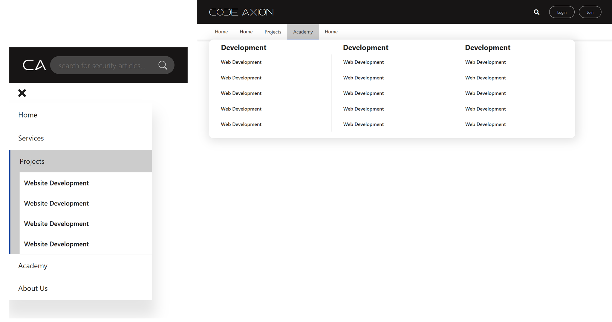
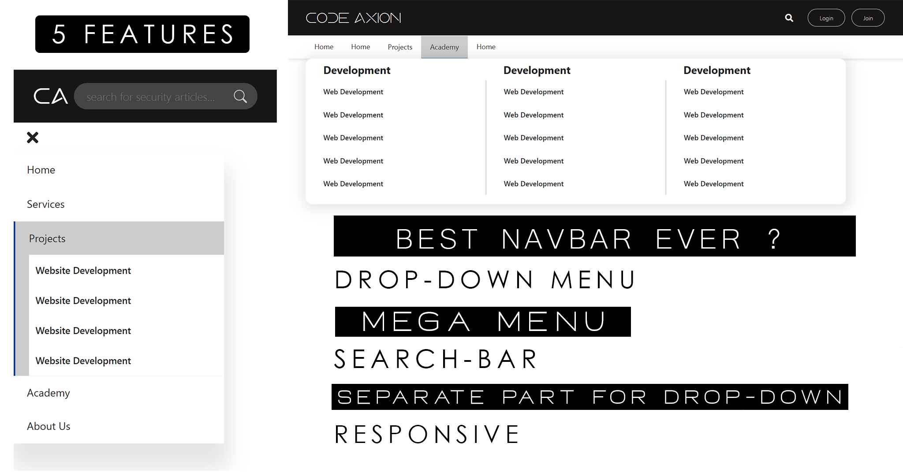
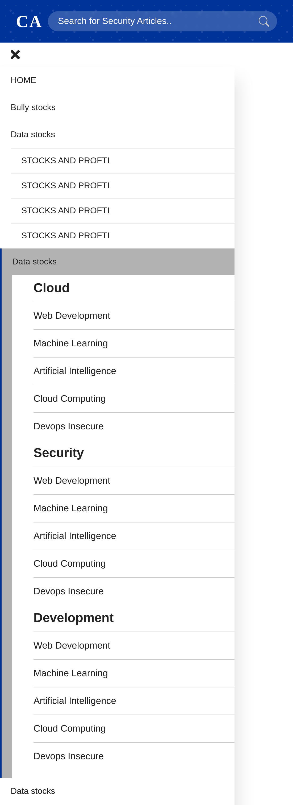

<h1>Responsive-Navbar-With-Dropdown-Menu-Html-And-CSS</h1>
  
<h2>AVAILABLE IN 2 VERSION</h2>
<h3>Youtube Link For Navbar: </h3>
<h2><a href="https://youtu.be/RLPe0vmzY1o">[+] BLACK VERSION:</a></h2> 

<h2>[+] BLUE VERSION:</h2> 

<h2>[+] Features</h2> 
<h2>[-] Responsive For Mobile</h2>
<h2>[-] Mega Menu Support</h2>
<h2>[-] Search Bar On Toggle</h2>
<h2>[-] Drop-Down Menu</h2>
<h2>[-] A Different Section For Dropdown Menu To Fit More Content</h2>
 
<h2>Desktop Version with Input/No-Input</h2>

<h2>Desktop/Tablet Version with Mega Menu</h2>

<h2>Mobile Version</h2>

